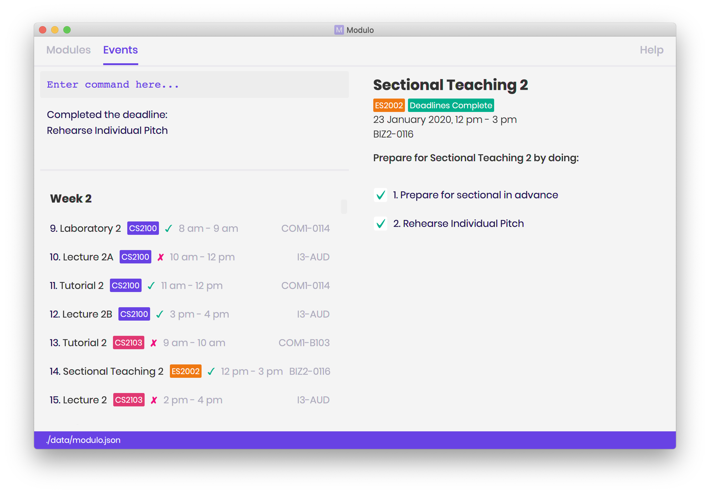

= Low Chen Yi, Sean - Project Portfolio
:site-section: AboutUs
:imagesDir: ../images
:stylesDir: ../stylesheets

== PROJECT: Modulo

---

== Overview

Modulo is for NUS students who prefer to use a desktop app for managing their school work on a modular level. It helps you to break down your modules into deadlines and track their progress.

Currently Modulo is made for NUS students taking modules this Academic Year AY2019/2020 Semester 2! More importantly,
Modulo is optimized for those who prefer to work with a Command Line Interface (CLI) while still having
the benefits of a Graphical User Interface (GUI). If you can type fast, Modulo can get your module management tasks done faster than traditional GUI apps.

== Summary of contributions

* *Major enhancement*: Implemented *Deletion function to delete modules, events and deadlines*
** What it does: allows the user to delete modules, events or deadlines
** Justification: This feature is important as it is an essential function should the user want to delete Modules, Events or Deadlines from Modulo.
** Highlights: This feature also allows for deletion of multiple Modules and Events at a time. For example while on the Module view,
`delete CS` will delete all modules containing `CS`. This provides an added convenience for the user should the user want to delete
some events / modules containing certain keywords. Modulo will also return the appropriate feedback should the user
enter invalid inputs or use the command inappropriately.

* *Minor enhancement*: Initial logic implementation to *switch between left panel views*.
** What it does: Refreshes the list view every time the user switches between module and event views.
** Justification: This feature was important as our team wanted to ensure that users were able to switch between list views in Modulo.

* *Minor enhancement*: Implemented *FindCommand*
** What it does: allows the user to find modules or events using certain keywords.
** Justification: This feature is important as it is an essential function should the user want to find modules or events by certain keywords.
** Highlights: This FindCommand allows additional filtering (not only once). For example if the user wants to search for `tutorial 1` from the module
`CS2103`, the user can first enter `find CS2103` and then `find tutorial 1`. Modulo will also return the appropriate feedback should the user
enter invalid inputs or use the command inappropriately.

* *Minor enhancement*: Implemented *ListCommand*
** What it does: allows the user to list modules or events on the left panel of Modulo.
** Justification: This feature is important as it allows the user to switch between the module and event view.

* *Minor enhancement*: Created *Module and Event Cards* to display the details of events and modules
** What it does: provides details of modules and events.
** Justification: This feature is important as it allows the user to see details of modules and events in the list
** Credit: Modified the Module and Event Cards with help from the original implementation of PersonCard from AddressBook3.

* *Code contributed*: [https://nus-cs2103-ay1920s2.github.io/tp-dashboard/#search=seanlowcy77&sort=groupTitle&sortWithin=title&since=2020-02-14&timeframe=commit&mergegroup=false&groupSelect=groupByRepos&breakdown=false&tabOpen=true&tabType=authorship&tabAuthor=seanlowcy77&tabRepo=AY1920S2-CS2103-T09-1%2Fmain%5Bmaster%5D[tP Code Dashboard]]
* *Functional Code contributed*:
** *Model*: [https://github.com/AY1920S2-CS2103-T09-1/main/blob/master/src/main/java/modulo/model/ModelManager.java[Model Manager]]
*** `getFilteredDisplayableList()`

** *View*: [https://github.com/AY1920S2-CS2103-T09-1/main/resources/view/ModuleListCard.fxml[Module List Card]][https://github.com/AY1920S2-CS2103-T09-1/main/resources/view/EventListCard.fxml[Event List Card]]

** *UI*: [https://github.com/AY1920S2-CS2103-T09-1/main/blob/master/src/main/java/modulo/ui/ModuleCard.java[Module Card]][https://github.com/AY1920S2-CS2103-T09-1/main/blob/master/src/main/java/modulo/ui/EventCard.java[Event Card]]

** *Logic*: [https://github.com/AY1920S2-CS2103-T09-1/main/blob/master/src/main/java/modulo/logic/commands/DeleteCommand.java[Delete Command]][https://github.com/AY1920S2-CS2103-T09-1/main/blob/master/src/main/java/modulo/logic/commands/FindCommand.java[Find Command]][https://github.com/AY1920S2-CS2103-T09-1/main/blob/master/src/main/java/modulo/logic/commands/ListCommand.java[List Command]][https://github.com/AY1920S2-CS2103-T09-1/main/blob/master/src/main/java/modulo/logic/commands/ListCommand.java[View Command]][https://github.com/AY1920S2-CS2103-T09-1/main/blob/master/src/main/java/modulo/logic/parser/DeleteCommandParser.java[Delete Command Parser]][https://github.com/AY1920S2-CS2103-T09-1/main/blob/master/src/main/java/modulo/logic/parser/ListCommandParser.java[List Command Parser]][https://github.com/AY1920S2-CS2103-T09-1/main/blob/master/src/main/java/modulo/logic/parser/ViewCommandParser.java[View Command Parser]][https://github.com/AY1920S2-CS2103-T09-1/main/blob/master/src/main/java/modulo/logic/predicate/NameContainsKeywordsPredicate.java[View Command Parser]]

* *Test Code Contributed*: [https://github.com/AY1920S2-CS2103-T09-1/main/blob/master/src/test/java/modulo/logic/commands/DeleteCommandTest.java[Delete Command Test]][https://github.com/AY1920S2-CS2103-T09-1/main/blob/master/src/test/java/modulo/logic/commands/AddEventCommandTest.java[Add Event Command Test]][https://github.com/AY1920S2-CS2103-T09-1/main/blob/master/src/test/java/modulo/logic/commands/AddDeadlineCommandTest.java[Add Deadline Command Test]][https://github.com/AY1920S2-CS2103-T09-1/main/blob/master/src/test/java/modulo/logic/commands/DeleteCommandParserTest.java[Delete Command Parser Test]][https://github.com/AY1920S2-CS2103-T09-1/main/blob/master/src/test/java/modulo/logic/commands/AddDeadlineCommandParserTest.java[Add Deadline Command Parser Test]][https://github.com/AY1920S2-CS2103-T09-1/main/blob/master/src/test/java/modulo/logic/commands/DoneCommandParserTest.java[Done Command Parser Test]][https://github.com/AY1920S2-CS2103-T09-1/main/blob/master/src/test/java/modulo/logic/predicate/NameContainsKeywordPredicateTest.java[Name Contains Keyword Predicate test]][https://github.com/AY1920S2-CS2103-T09-1/main/blob/master/src/test/java/modulo/logic/commands/ListCommandParserTest.java[List Command Parser Test]][https://github.com/AY1920S2-CS2103-T09-1/main/blob/master/src/test/java/modulo/logic/commands/ExportCommandParserTest.java[Export Command Parser Test]][https://github.com/AY1920S2-CS2103-T09-1/main/blob/master/src/test/java/modulo/logic/commands/ListCommandTest.java[List Command Test]][https://github.com/AY1920S2-CS2103-T09-1/main/blob/master/src/test/java/modulo/logic/commands/FindCommandParserTest.java[Find Command Parser Test]][https://github.com/AY1920S2-CS2103-T09-1/main/blob/master/src/test/java/modulo/logic/commands/ViewCommandParserTest.java[View Command Parser Test]]

== Contributions to the User Guide

|===
|_Given below are sections I contributed to the User Guide.
|===

include::../UserGuide.adoc[tag=list]

include::../UserGuide.adoc[tag=find]

include::../UserGuide.adoc[tag=delete]

== Contributions to the Developer Guide

|===
|_Given below are sections I contributed to the Developer Guide.
|===

include::../DeveloperGuide.adoc[tag=architecture]

include::../DeveloperGuide.adoc[tag=logic]

include::../DeveloperGuide.adoc[tag=delete]

include::../DeveloperGuide.adoc[tag=ucthree]

